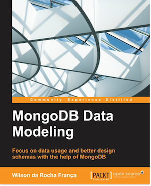

[](https://gitpitch.com/enogrob/ebook-project/master)
```
Roberto Nogueira  
BSd EE, MSd CE
Solution Integrator Experienced - Certified by Ericsson
```
# eBook project



**About**

Learn everything you need to about the subject of this `eBook` project.

[Homepage](https://www.packtpub.com/big-data-and-business-intelligence/mongodb-data-modeling)

## Topics
```
1: INTRODUCING DATA MODELING
[ ] The relationship between MongoDB and NoSQL
[ ] Introducing NoSQL (Not Only SQL)
[ ] Database design and data modeling
[ ] Summary
2: DATA MODELING WITH MONGODB
[ ] Introducing documents and collections
[ ] Characteristics of documents
[ ] Designing a document
[ ] Common document patterns
[ ] Summary
3: QUERYING DOCUMENTS
[ ] Understanding the read operations
[ ] Introducing the write operations
[ ] Summary
4: INDEXING
[ ] Indexing documents
[ ] Creating special indexes
[ ] Summary
5: OPTIMIZING QUERIES
[ ] Understanding the query plan
[ ] Summary
6: MANAGING THE DATA
[ ] Operational segregation
[ ] Capped collections
[ ] Data self-expiration
[ ] Summary
7: SCALING
[ ] Scaling out MongoDB with sharding
[ ] Scaling a social inbox schema design
[ ] Summary
8: LOGGING AND REAL-TIME ANALYTICS WITH MONGODB
[ ] Log data analysis
[ ] What we are looking for
[ ] Designing the schema
[ ] Summary
```
